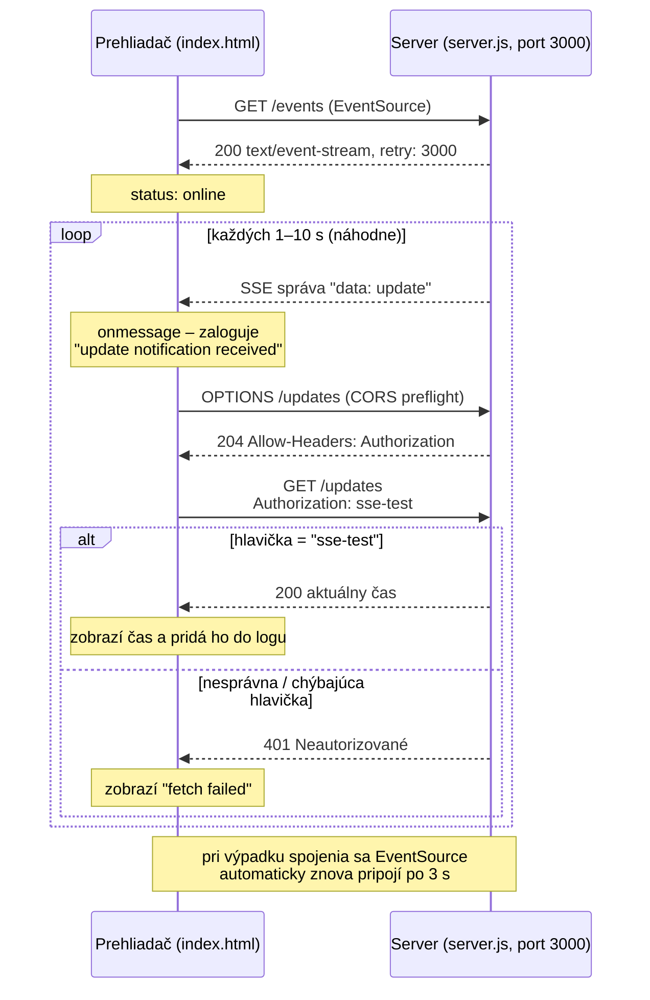

# SSE demo

## 1. zapni server

`node server.js`

## 2. otvor stránku

`open index.html`

## Ako to funguje

SSE stream (`/events`) slúži len ako notifikačný kanál – neprenáša žiadne dáta.
Keď príde notifikácia, klient si aktuálne dáta vyžiada samostatným requestom
na `/updates`, autentifikovaným hlavičkou `Authorization: sse-test`.

